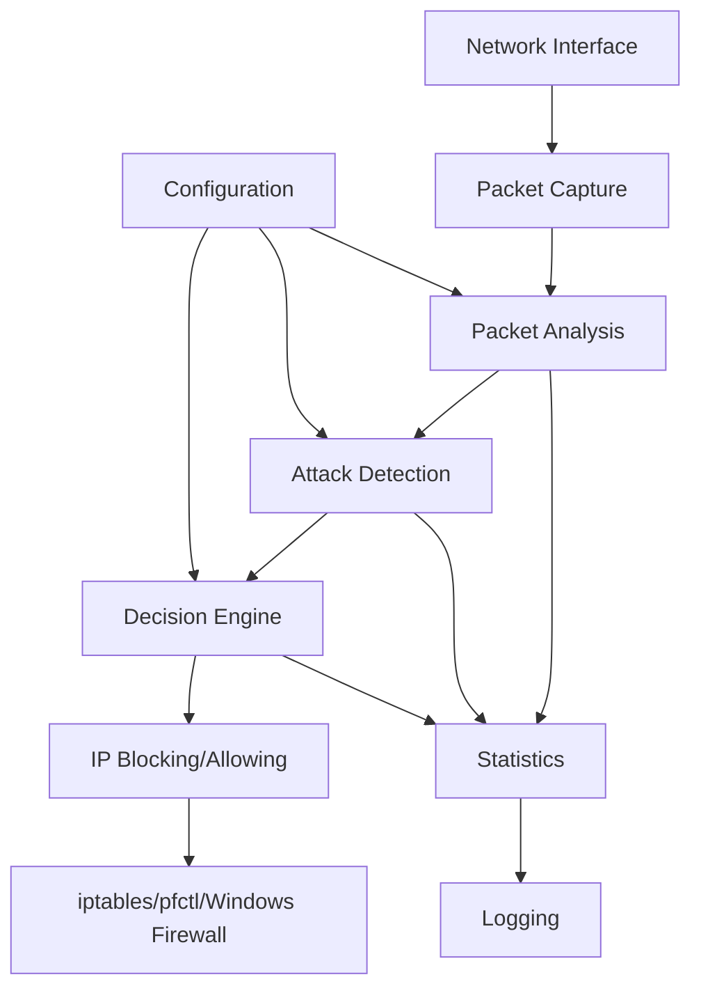

# Simple Firewall - Project Tour

Welcome to the Simple Firewall project! This document provides a comprehensive walkthrough of the project structure, architecture, and codebase. Whether you're a new contributor or trying to understand the system, this guide will help you navigate the project effectively.

## 📁 Project Structure Overview

```
simple_firewall/
├── .github/                    # GitHub-specific configuration
│   ├── Contributor_Guide/      # Documentation for contributors
│   │   ├── Contributing.md     # Contribution guidelines
│   │   └── Project_Tour.md     # This file
│   └── workflows/              # CI/CD workflows (if present)
├── .husky/                     # Git hooks management
│   ├── commit-msg             # Commit message validation
│   ├── pre-commit             # Pre-commit checks
│   └── _/                     # Husky internals
├── src/                       # 🏗️ Modular source code (NEW!)
│   ├── __init__.py
│   ├── config/                # ⚙️ Configuration management
│   │   ├── __init__.py
│   │   ├── loader.py          # Config loading & validation
│   │   └── models.py          # Configuration dataclasses
│   ├── firewall/              # 🛡️ Core firewall logic
│   │   ├── __init__.py
│   │   ├── core.py            # Main firewall orchestration
│   │   ├── detection.py       # Attack detection algorithms
│   │   ├── blocking.py        # IP blocking management
│   │   └── stats.py           # Statistics tracking
│   ├── network/               # 🌐 Network operations
│   │   ├── __init__.py
│   │   ├── interface.py       # Network interface detection
│   │   └── packet_handler.py  # Packet capture & analysis
│   └── utils/                 # 🔧 Utility functions
│       ├── __init__.py
│       ├── logger.py          # Logging setup
│       └── system.py          # System utilities
├── tests/                     # 🧪 Comprehensive test suite
│   ├── __init__.py
│   ├── test_config.py         # Configuration tests
│   ├── test_stats.py          # Statistics tests
│   └── test_system.py         # System utility tests
├── tools/                     # 🔨 Development & testing tools
│   └── attack_simulator.py    # Attack simulation for testing
├── main.py                    # 🚀 Modern CLI entry point (NEW!)
├── firewall_config.json       # ⚙️ Configuration file
├── run.py                     # 🔄 Legacy launcher (redirects to main.py)
├── install.sh                 # 📦 Installation script
├── requirements.txt           # 📋 Python dependencies
├── package.json              # 📦 Node.js dependencies (dev tools)
├── commitlint.config.js      # ✅ Commit message rules
├── README.md                 # 📖 Project overview
└── CODE_OF_CONDUCT.md        # 📜 Community guidelines
```

## 🏗️ Architecture Overview

Simple Firewall v2.0 follows a **modular, clean architecture** with separation of concerns:



### Core Components

1. **Configuration Layer** (`src/config/`): Robust config loading with validation
2. **Network Layer** (`src/network/`): Packet capture and interface management
3. **Detection Engine** (`src/firewall/detection.py`): Attack pattern recognition
4. **Blocking System** (`src/firewall/blocking.py`): Cross-platform IP blocking
5. **Statistics Engine** (`src/firewall/stats.py`): Real-time monitoring
6. **Main Orchestrator** (`src/firewall/core.py`): Coordinates all components
7. **CLI Interface** (`main.py`): Modern command-line interface

## 📄 File-by-File Deep Dive

### 🚀 `main.py` - Modern CLI Entry Point

The new command-line interface providing a clean user experience:

```python
# Key features:
# - Configuration template generation
# - System statistics display  
# - Firewall initialization with proper error handling
# - Cross-platform compatibility checks

python3 main.py --create-config  # Generate config template
python3 main.py --stats          # Show system statistics
sudo python3 main.py            # Start firewall
```

### 🏗️ `src/firewall/core.py` - Main Orchestration

The heart of the firewall system, coordinating all components:

#### Key Classes

**`SimpleFirewall`** - Main orchestration class
```python
class SimpleFirewall:
    """
    Main firewall orchestrator coordinating all components
    - Loads configuration via ConfigLoader
    - Initializes network interfaces
    - Starts packet capture threads
    - Coordinates detection and blocking
    - Manages statistics and cleanup
    """
```

### ⚙️ `src/config/loader.py` & `models.py` - Configuration Management

**`ConfigLoader`** - Robust configuration loading
```python
class ConfigLoader:
    """
    Handles configuration loading with validation and helpful error messages
    - JSON parsing with detailed error reporting
    - Schema validation for all config sections
    - Template generation for missing configurations
    - Colorized user feedback
    """
```

**`FirewallConfig`** - Configuration dataclass
```python
@dataclass
class FirewallConfig:
    """Configuration model with type safety and validation"""
    thresholds: AttackThresholds
    whitelist: List[str]
    block_duration: int
    log_level: str
    interface: Optional[str] = None
```

### 🛡️ `src/firewall/detection.py` - Attack Detection Engine

Specialized attack detection algorithms:
- **SYN Flood Detection**: Monitors TCP SYN patterns
- **Port Scan Detection**: Tracks port access patterns  
- **Rate Limiting**: General packet rate analysis
- **ICMP Flood Detection**: ICMP packet monitoring
- **Sliding Window**: Time-based analysis with cleanup

#### Key Methods Explained

```python
def _detect_attacks(self, packet):
    """
    Core attack detection logic
    
    Flow:
    1. Extract source IP from packet
    2. Clean old tracking entries (sliding window)
    3. Update packet counters
    4. Check against thresholds:
       - Packet rate (general DDoS)
       - SYN flood detection
       - Port scan detection
       - Connection rate limiting
       - ICMP flood detection
    5. Block IP if threshold exceeded
    """
```

```python
def _block_ip(self, ip: str, reason: str):
    """
    Block IP using OS firewall
    
    Linux: iptables -A INPUT -s <ip> -j DROP
    macOS: pfctl (implementation needed)
    Windows: netsh/Windows Firewall API (implementation needed)
    """
```

#### Attack Detection Algorithms

1. **SYN Flood Detection**
   - Tracks SYN packets with TCP flags & 0x02
   - Uses sliding window (1 minute)
   - Threshold-based blocking

2. **Port Scan Detection**
   - Monitors unique destination ports per IP
   - Detects reconnaissance attempts
   - Configurable sensitivity

3. **Rate Limiting**
   - General packet rate per IP
   - Connection rate limiting
   - ICMP flood detection

4. **Sliding Window Implementation**
   ```python
   # Clean entries older than 1 minute
   minute_ago = current_time - timedelta(minutes=1)
   while self.ip_packets[ip] and self.ip_packets[ip][0] < minute_ago:
       self.ip_packets[ip].popleft()
   ```

### ⚙️ `firewall_config.json` - Configuration

JSON-based configuration system with validation:

```json
{
    "thresholds": {
        "syn_flood_threshold": 1000,      // SYN packets/min before blocking
        "connection_threshold": 200,       // Connections/min before blocking
        "packet_rate_threshold": 1000,     // Total packets/min before blocking
        "port_scan_threshold": 80,         // Unique ports before blocking
        "icmp_flood_threshold": 1000       // ICMP packets/min before blocking
    },
    "whitelist": [                        // IPs never to block
        "::1",                           // IPv6 localhost
        "127.0.0.1",                     // IPv4 localhost
        "192.168.1.0/24"                 // Local network range
    ],
    "block_duration": 300,                // Seconds to block IPs
    "log_level": "INFO"                   // Logging verbosity
}
```

**Configuration Validation**:
- Required sections: `thresholds`
- Required thresholds: All 5 attack types
- Helpful template generation when missing
- JSON syntax validation

### 🔒 `src/firewall/blocking.py` - IP Blocking Management

Cross-platform IP blocking implementation:
```python
class IPBlocker:
    """
    Manages IP blocking across different operating systems
    - Linux: iptables integration
    - macOS: pfctl support (framework ready)
    - Windows: Windows Firewall API (framework ready)
    - Automatic cleanup and timeout management
    """
```

### 📊 `src/firewall/stats.py` - Statistics Engine

Real-time statistics tracking:
```python
class FirewallStats:
    """
    Comprehensive statistics tracking
    - Attack attempt counters
    - Blocked IP management
    - Performance metrics
    - Time-based analysis
    - Export capabilities for GUI
    """
```

### 🌐 `src/network/` - Network Operations

**`interface.py`** - Network interface detection
**`packet_handler.py`** - Packet capture and processing using Scapy

### 🔧 `src/utils/` - Utility Functions

**`logger.py`** - Centralized logging setup
**`system.py`** - Cross-platform system utilities

### 🧪 `tools/attack_simulator.py` - Testing & Simulation

Attack simulation script for testing firewall effectiveness:

```python
# Example usage patterns:
# 1. SYN Flood Simulation
# 2. Port Scan Simulation  
# 3. ICMP Flood Simulation
# 4. High Connection Rate Testing
```

### 🎯 `run.py` - Legacy Launcher Script

Backwards compatibility launcher that redirects to main.py:
```python
#!/usr/bin/env python3
"""Legacy launcher - redirects to main.py"""
import subprocess
import sys

if __name__ == "__main__":
    subprocess.run([sys.executable, "main.py"] + sys.argv[1:])
```


### 📦 `install.sh` - Installation Script

Cross-platform installation automation:
```bash
#!/bin/bash
# 1. Detect OS and package manager
# 2. Install Python dependencies
# 3. Set up virtual environment
# 4. Configure system permissions
# 5. Create systemd service (Linux)
```

### 📋 `requirements.txt` - Dependencies

```
scapy>=2.4.0          # Packet capture and analysis
psutil>=5.8.0          # System and process utilities
colorama>=0.4.0        # Cross-platform colored terminal text
netifaces>=0.11.0      # Network interface detection
```

### 📦 `package.json` - Development Tools

```json
{
  "name": "simple_firewall",
  "scripts": {
    "commitlint": "commitlint --edit",
    "prepare": "husky install"
  },
  "devDependencies": {
    "@commitlint/config-conventional": "^17.0.0",
    "@commitlint/cli": "^17.0.0",
    "husky": "^8.0.0"
  }
}
```

## 🧵 Threading Architecture

The firewall uses multiple threads across different modules:

```python
# Main thread: Packet capture (src/network/packet_handler.py)
sniff(iface=self.interface, prn=self._packet_handler)

# Background cleanup thread (src/firewall/core.py)
cleanup_thread = threading.Thread(target=self._cleanup_thread, daemon=True)

# Statistics reporting thread (src/firewall/stats.py)  
stats_thread = threading.Thread(target=self._stats_thread, daemon=True)

# IP blocking management (src/firewall/blocking.py)
blocking_thread = threading.Thread(target=self._manage_blocks, daemon=True)
```

**Thread Safety**: 
- Module-level thread safety with proper locking
- Atomic operations for counter updates
- Thread-safe collections shared between modules
- Clean shutdown coordination across all components

## 🔒 Security Considerations

### Current Implementation
- **Input Validation**: IP address validation, config file validation
- **Privilege Management**: Requires root/admin for firewall operations
- **Whitelist Protection**: Prevents blocking critical IPs
- **Rate Limiting**: Prevents resource exhaustion

### Future Enhancements Needed
- **Authentication**: For GUI access
- **Encryption**: For remote management
- **Audit Logging**: For compliance
- **Privilege Separation**: Minimize root requirements

## 🖥️ Cross-Platform Compatibility

### Current Status

| Platform | Packet Capture | Firewall Rules | Status |
|----------|---------------|----------------|---------|
| Linux    | ✅ Scapy      | ✅ iptables    | ✅ Full Support |
| macOS    | ✅ Scapy      | ❌ pfctl       | ⚠️ Partial |
| Windows  | ✅ Scapy      | ❌ netsh/API   | ⚠️ Partial |

### Implementation Plan

#### macOS Support (`_block_ip_macos`)
```python
def _block_ip_macos(self, ip: str):
    """Block IP using pfctl on macOS"""
    subprocess.run([
        'sudo', 'pfctl', '-t', 'blocked_ips', '-T', 'add', ip
    ], check=True)
```

#### Windows Support (`_block_ip_windows`)
```python
def _block_ip_windows(self, ip: str):
    """Block IP using Windows Firewall"""
    subprocess.run([
        'netsh', 'advfirewall', 'firewall', 'add', 'rule',
        'name=SimpleFirewall_Block', f'remoteip={ip}', 'action=block'
    ], check=True)
```

## 🎨 Code Style & Standards

### Python Style Guide
- **PEP 8** compliance
- **Type hints** for all functions
- **Docstrings** in Google style
- **Line length**: 88 characters (Black formatter)

### Example Function Documentation
```python
def _detect_attacks(self, packet) -> None:
    """
    Analyze packet for potential attack patterns.
    
    Args:
        packet: Scapy packet object to analyze
        
    Returns:
        None
        
    Side Effects:
        - Updates tracking dictionaries
        - May trigger IP blocking
        - Logs attack detection events
        
    Raises:
        None: All exceptions are handled internally
    """
```

### Variable Naming Conventions
- **Classes**: PascalCase (`SimpleFirewall`, `AttackSignature`)
- **Functions**: snake_case (`_detect_attacks`, `_block_ip`)
- **Constants**: UPPER_SNAKE_CASE (`DEFAULT_THRESHOLD`)
- **Private methods**: Leading underscore (`_cleanup_old_entries`)

### Import Organization
```python
# Standard library imports
import os
import sys
import threading

# Third-party imports  
from scapy.all import sniff, IP, TCP
import psutil

# Local imports
from .config import load_configuration
```

## 🧪 Testing Strategy

### Current Testing Framework
- **Unit Tests**: 20+ comprehensive tests covering all modules
- **Integration Testing**: `tools/attack_simulator.py` for real attack simulation
- **Module Testing**: Each src/ module has dedicated test coverage
- **Configuration Testing**: Robust config validation testing

### Test Structure
```python
# Current test suite (20+ tests)
tests/
├── test_config.py          # ConfigLoader and validation (9 tests)
├── test_stats.py           # FirewallStats functionality (6 tests)  
├── test_system.py          # System utilities (5+ tests)
└── __init__.py
```

### Running Tests
```bash
# Comprehensive test suite
make test                           # All tests with clean output
make test-verbose                   # Detailed test output
python -m pytest tests/ -v         # Direct pytest execution
python -m pytest tests/test_config.py -v  # Specific module

# Expected output: 20+ tests passing
```

### Example Unit Test (Updated for New Architecture)
```python
def test_config_loading():
    """Test configuration loading with new ConfigLoader"""
    from src.config.loader import ConfigLoader
    
    loader = ConfigLoader()
    config = loader.load('firewall_config.json')
    
    # Verify config structure
    assert config.thresholds.syn_flood_threshold > 0
    assert len(config.whitelist) > 0
    assert config.block_duration > 0
```

## 🚀 Future Development Roadmap

### Phase 1: Platform Compatibility (Current)
- [ ] Complete macOS support with pfctl
- [ ] Implement Windows firewall integration
- [ ] Cross-platform testing suite
- [ ] Platform-specific installation scripts

### Phase 2: GUI Development
- [ ] **Web Dashboard**: React + Flask/FastAPI backend
- [ ] **Real-time Monitoring**: WebSocket connections for live updates
- [ ] **Configuration Interface**: GUI-based config management
- [ ] **Alert System**: Email/Slack/Discord notifications

### Phase 3: Advanced Features
- [ ] **Machine Learning**: AI-based attack detection
- [ ] **Geographic Analysis**: IP location tracking
- [ ] **Custom Rules**: User-defined detection patterns
- [ ] **API Integration**: REST API for external systems


## 🤝 Contributing Guidelines

### Getting Started
1. Read the [Contributing Guide](Contributing.md)
2. Set up development environment
3. Pick an issue labeled `good-first-issue`
4. Follow the pull request process

### Development Workflow
```bash
# 1. Create feature branch
git checkout -b feature/gui-dashboard

# 2. Set up development environment
make help                    # See all available commands
python3 main.py --create-config  # Generate config

# 3. Make changes with proper commits
git commit -m "feat: add real-time dashboard component"

# 4. Run comprehensive tests
make test                    # Full test suite (20+ tests)
make test-verbose            # Detailed output

# 5. Test the firewall functionality
make dev                     # Development mode (no sudo)
sudo python3 main.py         # Test firewall operation

# 6. Create pull request
```

### Code Review Process
- All PRs require review from maintainers
- Automated checks: linting, testing, security scanning
- Manual testing on multiple platforms
- Documentation updates required for new features

## 📚 Documentation System

### Current Documentation
- **README.md**: Overview and quick start
- **This file**: Comprehensive project tour
- **Contributing.md**: Contribution guidelines
- **Inline documentation**: Docstrings and comments

### Planned Documentation
- **API Documentation**: Auto-generated from docstrings
- **User Manual**: End-user guide with screenshots
- **Architecture Diagrams**: Visual system overview
- **Deployment Guide**: Production setup instructions

## 🎯 Key Takeaways for New Contributors

1. **Start Small**: Begin with documentation or simple bug fixes
2. **Understand the Flow**: Packet → Analysis → Decision → Action
3. **Test Thoroughly**: Network security requires rigorous testing
4. **Security First**: Always consider security implications
5. **Cross-Platform**: Keep compatibility in mind for all changes
6. **Document Everything**: Help future contributors understand your work

---

**Ready to contribute?** Check out our [open issues](https://github.com/OPCODE-Open-Spring-Fest/simple_firewall/issues) and join the community! 🛡️✨ 